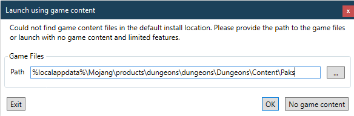
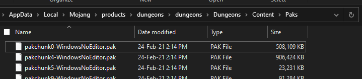
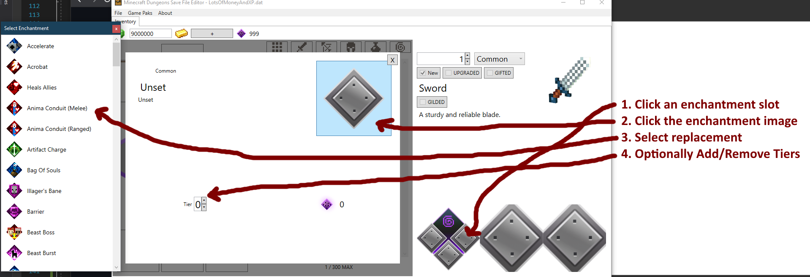

# &nbsp;[]() Minecraft: Dungeons Save File Editor

[](https://github.com/CutFlame/MCDSaveEdit/blob/master/LICENSE)
[](https://github.com/CutFlame/MCDSaveEdit/releases/latest)
[](https://github.com/CutFlame/MCDSaveEdit/releases/latest)
[](https://github.com/CutFlame/MCDSaveEdit/releases)
[](https://patreon.com/cutflame)

Windows application for modifying [Minecraft: Dungeons](https://www.minecraft.net/en-us/about-dungeons/) save files.

#### DISCLAIMER: Please keep backups of your save files! This app does not guarantee your save file to be playable after editing!


---

### Installing and Running

For full features and functionality you need Minecraft: Dungeons installed and preferably in the default install location.

1. Download and extract the latest release (MCDSaveEdit_*.zip) from [the releases section](https://github.com/CutFlame/MCDSaveEdit/releases)

---

### Troubleshooting

##### Fix Missing Images



If you see this popup, that means it couldn't find the game content in the default location. You need to provide the path to these `.pak` files:



##### Default location of pak files

Minecraft Launcher:

`%localappdata%\Mojang\products\dungeons\dungeons\Dungeons\Content\Paks`

Steam:

`%programfiles(x86)%\Steam\steamapps\common\MinecraftDungeons\Dungeons\Content\Paks`

Microsoft Store:

`C:\XboxGames\Minecraft Dungeons\Content\Dungeons\Content\Paks`

If you're not sure which version you have, additional information may be found on [Dokustash - stash.dokucraft.co.uk](https://stash.dokucraft.co.uk/?help=modding-dungeons)

##### Application Stopped Working

If during launch you get a popup saying that MCDSaveEdit has stopped working,
this means an internal error ocurred and could mean various issues.
MCDSaveEdit has a dependency on .NET Framework 4.8 so you could try installing that.

- [.NET Framework Offline installer](https://support.microsoft.com/en-us/topic/microsoft-net-framework-4-8-offline-installer-for-windows-9d23f658-3b97-68ab-d013-aa3c3e7495e0)

---

### How to Use

1. Go to `File > Open` in the menu bar.
2. Open the folder `%HOMEPATH%\Saved Games\Mojang Studios\Dungeons`. *Be sure to backup this folder before editing your save files.*
3. You will see a folder with a 16-digit number (E.g. 2612325419657064). Open this folder, then open the "Characters" folder.
    1. NOTE: If multiple Mojang or Microsoft accounts were used in-game you might see more than one folder. 
4. Select one of the files ending in `.dat`. There will be one for each character.
5. Click `Open` and edit your save. When ready go to `File > Save` or `File > Save As...` to save your edits.

<p></p>

##### Adding Items


<p></p>

##### Adding/Changing Enchantments



<p></p>

---

### Compiling

This application was developed entirely in Visual Studio 2022.

When cloning be sure to recurse through submodules because there are 2:

- [DungeonTools](https://github.com/CutFlame/DungeonTools/tree/save-file-editor-1.1)
- [PakReader](https://github.com/CutFlame/PakReader/tree/MCDSaveEdit)

Provide the AES key to decrypt the game files:

`MCDSaveEdit\Data\Secrets.cs`
```csharp
namespace MCDSaveEdit.Data
{
    public static class Secrets
    {
        // Fill in the value for this one
        public static AesKey[] PAKS_AES_KEYS = new AesKey[] {
            new AesKey("<AES key for unlocking the MCD .pak files>", ""),
        };

        // You can leave these empty, they just need to exist
        public const string GAME_ANALYTICS_GAME_KEY = "";
        public const string GAME_ANALYTICS_SECRET_KEY = "";
    }
}
```

Another bit of trouble you might run into is the error: "The referenced component 'Windows' could not be found" in `MCDSaveEdit/Data/Constants.cs` line 3: `using Windows.Management.Deployment;`

- Try the accepted answer [here](https://stackoverflow.com/questions/54454214/how-to-access-windows-management-deployment-namespace-in-a-desktop-project-in-vs).
- This bit of code is only required for the Microsoft Store version, so if you have the launcher version you can just comment out lines 3 and 54 through 61.

---

### Legal Disclaimer

This project is not affiliated with Mojang Studios, Microsoft, XBox Game Studios, Double Eleven or the Minecraft brand.

"Minecraft" is a trademark of Mojang Synergies AB.

Other trademarks referenced herein are property of their respective owners.

### External Credits and Licenses

Images from the game are subject to copyright by Mojang. They are extracted at runtime from the .pak files that are installed as part of the Minecraft: Dungeons game files.

[DungeonTools](https://github.com/HellPie/DungeonTools) © Diego Russi ([AGPL 3.0](https://github.com/HellPie/DungeonTools/blob/master/LICENSE))

[Microsoft.Bcl.AsyncInterfaces](https://github.com/dotnet/corefx) © Microsoft ([MIT](https://licenses.nuget.org/MIT))

[Fody](https://github.com/Fody/Fody) © Simon Cropp ([MIT](https://github.com/Fody/Fody/blob/master/License.txt))

[Costura.Fody](https://github.com/Fody/Costura) © Simon Cropp and contributors ([MIT](https://github.com/Fody/Costura/blob/develop/LICENSE))

[FModel](https://github.com/iAmAsval/FModel) © Free Software Foundation, Inc. ([GPL 3.0](https://github.com/iAmAsval/FModel/blob/master/LICENSE))

[PakReader](https://github.com/WorkingRobot/PakReader) © Aleks Margarian ([MIT](https://github.com/WorkingRobot/PakReader/blob/master/LICENSE))

[Game-icons.net](https://game-icons.net/) © Lorc, Delapouite and contributors ([CC BY 3.0](http://creativecommons.org/licenses/by/3.0/))
