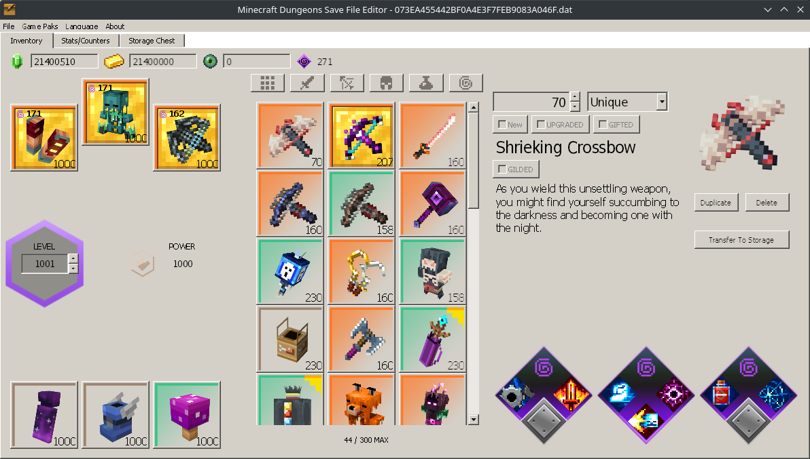
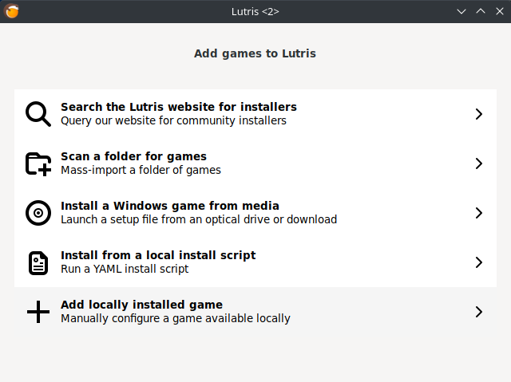
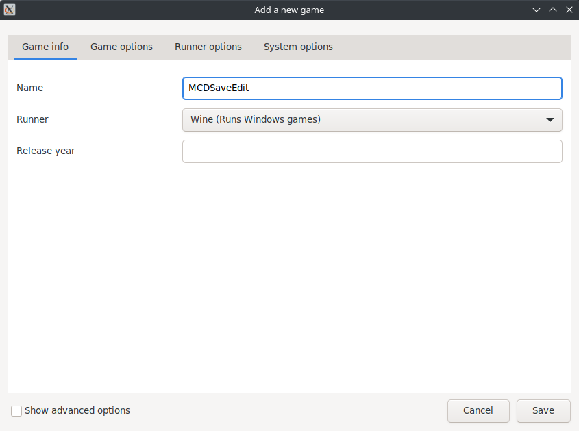
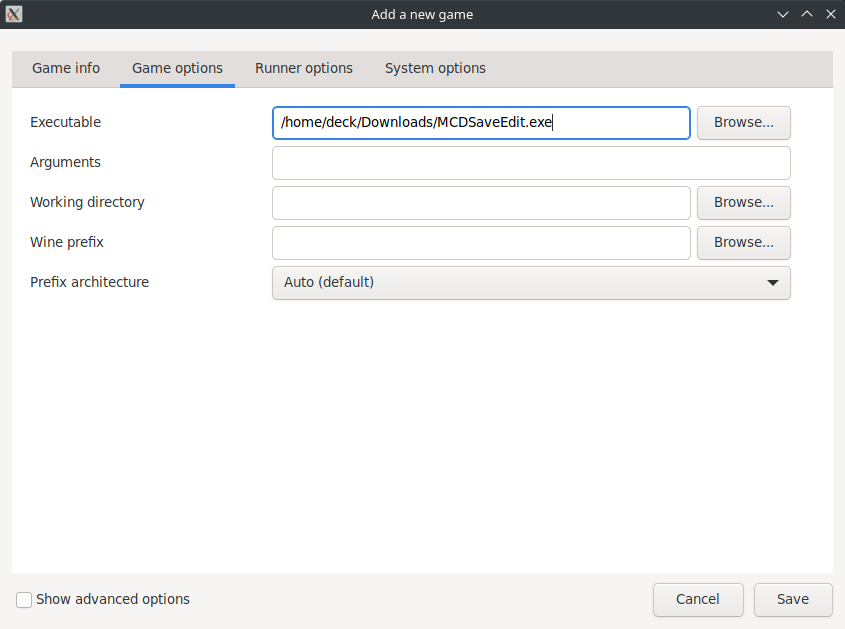
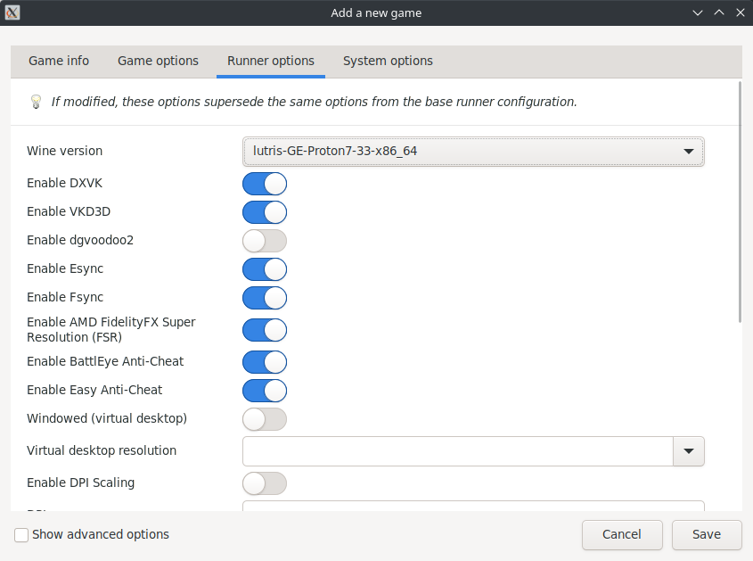
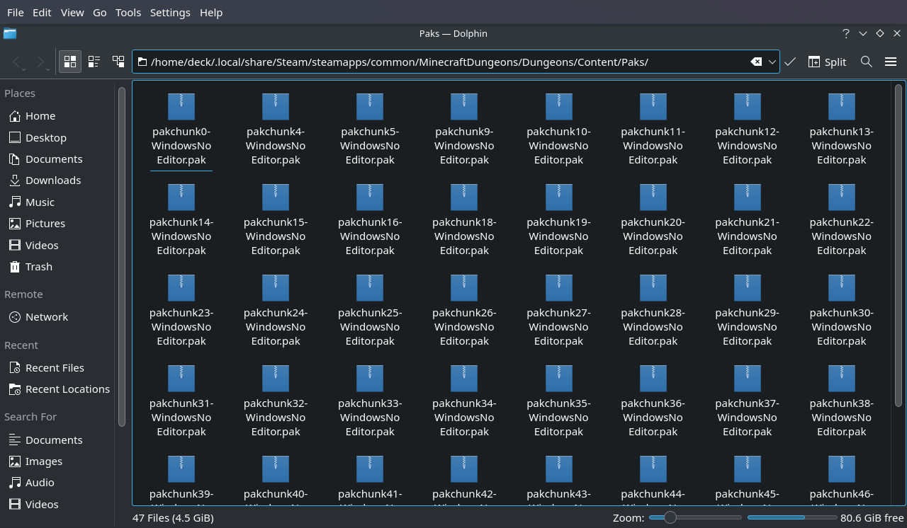
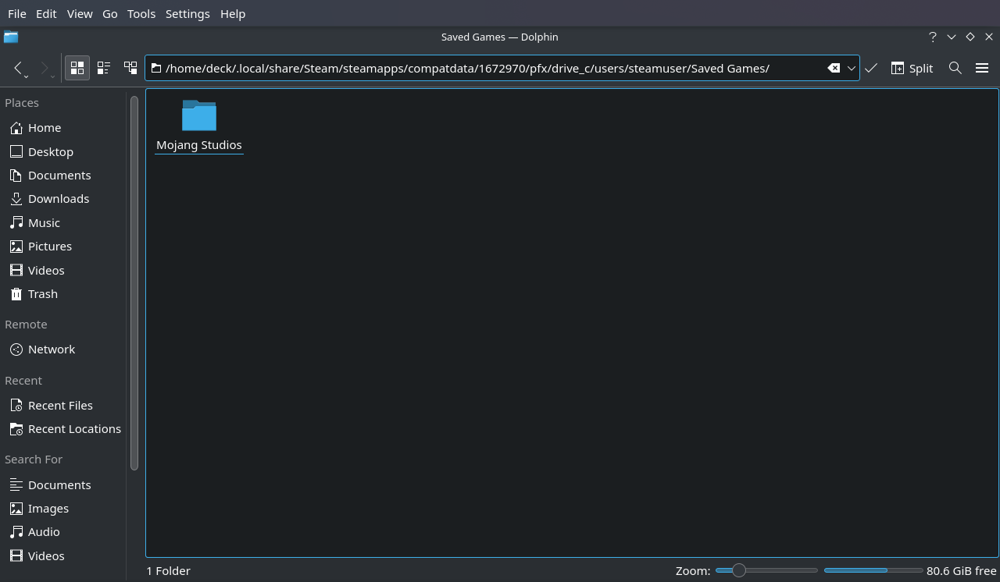

# &nbsp; Minecraft: Dungeons Save File Editor on Steam Deck

How to get MCDSaveEdit working on Steam Deck with MCD purchased from Steam

#### DISCLAIMER: Please keep backups of your save files! This app does not guarantee your save file to be playable after editing!

---

### Installing and Running on Steam Deck

#### NOTE: For full features and functionality you need Minecraft: Dungeons installed and preferably in the default install location.

1. Switch to [Desktop Mode](https://www.tomsguide.com/how-to/how-to-enable-desktop-mode-on-the-steam-deck)
1. Download and Install [Lutris](https://lutris.net/downloads)
1. Download and extract [MCDSaveEdit 1.5.8.0+](https://github.com/CutFlame/MCDSaveEdit/releases)
1. Add MCDSaveEdit to Lutris
	1. Launch Lutris
	1. Click Plus button top left corner
	1. Select "Add Locally Installed Game" 
	 
	1. Fill out details
		
-- Game Info --

		Set Name as `MCDSaveEdit`
		Set Runner as "Wine" 
		
		
-- Game Options --

		Set Executable to wherever to put it, like: `/home/deck/Downloads/MCDSaveEdit.exe` 
		
		
-- Runner Options --

		The default Wine version should work, 
			but in case it doesn't I saw success with "lutris-GE-Proton7-33-x86_64" 
		 
1. Launch MCDSaveEdit from within Lutris by hitting the play button
1. Locate Steam MCD Pak files (if MCDSaveEdit can't find them)
	Default location is `/home/deck/.local/share/Steam/steamapps/common/MinecraftDungeons/Dungeons/Content/Paks/` 
	
1. Locate Character files
	Most likely at `/home/deck/.local/share/Steam/steamapps/compatdata/1672970/pfx/drive_c/users/steamuser/Saved Games/Mojang Studios/Dungeons/{longNumber}/Characters/` 
	
1. Drag and drop a character file into MCDSaveEdit
1. Modify and Save to your hearts desire
